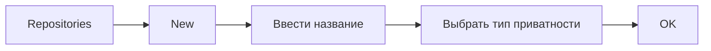
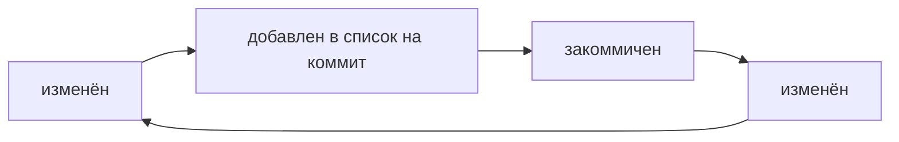
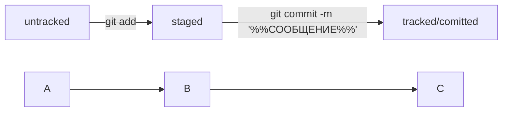

# Заметки о работе с Bash, Git и GitHub
Git - система контроля версий

---

## Работа с командной строкой (BASH)
1. Текущий рабочий каталог

```
pwd
```

3. Содержимое текущего каталога

```
ls
```
    
4. Создание каталога
   
```
mkdir %НАЗВАНИЕ_КАТАЛОГА%
```

5. Копировать
   
```
cp file.txt %ПУТЬ%
```

6. Переместить
   
```
mv file.txt %ПУТЬ%
```

7. Удалить:
|   Данные      |   Команда        |
|     ---       |     ---          |
|    Файл       |> rm file.txt     |
|Пустая папка   |> rmdir /empty_DIR|
|Папка с файлами|> rm -r /DIR      |

## Регистрация на GitHub
1. Перейти на главную страницу GitHub
> https://github.com/
	
2. Проходим регистрацию

## Создание удаленного репозитория

1. Зайти в профиль GitHub
   
>https://github.com/username
	
2. Создаем удаленный репозиторий



## SSH-ключи
1. Генерируем SSH-ключ

```
ssh-keygen -t rsa -b 4096 -C "электронная почта, к которой привязан ваш аккаунт на GitHub"
```
	
3. Копировать содержимое ключа в буфер обмена:

```
clip < ~/.ssh/id_rsa.pub
```
	
4. Привязываем SSH-ключ к GitHub

> Заходим в аккаунт GitHub -> Settings -> SSH and GPG keys -> New SSH key -> Вводим название и вставляем скопированный в буфер обмена ключ -> Add SSH key
	
6. Проверка ключа
```
ssh -T git@github.com
```
>Ввести <b>YES</b>
>
>Получить в ответ: *Hi %ВАШ_АККАУНТ%! You've successfully authenticated, but GitHub does not provide shell access.*
	
## Связываем локальный и удалённый репозитории
1. Открыть папку проекта
	
```
cd /папка_проекта
```
    
2. Инициализировать проект

```
git init
``` 
   
3. Добавить файл
```
git add README.md
```

4. Создать коммит

```
git commit -m "first commit"
```

5. Создать ветку
   
```
git branch -M main
```
    
6. Привязать локальный репозиторий к удалённому
   
```
git remote add origin https://github.com/%ИМЯ_АККАУНТА%/%ИМЯ_ПРОЕКТА%.git
```
	
8. Отправить изменения на удаленный репозиторий

```
git push -u origin master
```

---

## О ХЕШах
*Хеш — идентификатор коммита*

- Git преобразует информацию о коммитах с помощью алгоритма SHA-1 и для каждого из них рассчитывает уникальный идентификатор — хеш.
- Хеш — основной идентификатор коммита и позволяет узнать его автора, дату и содержимое закоммиченных файлов.
- Все хеши, а также таблицу соответствий хеш → информация о коммите Git хранит в папке ```.git```

1. Вывод истории коммитов

```
git log
```

*Вывод будет содержать:* **хеш, автора, дату и сообщение**

2. Вывод сокращенного лога

```
git log --oneline
```

3. Файл **HEAD**
- В папке .git есть служебный файл HEAD. Он указывает на самый свежий коммит.
- Вместо хеша последнего коммита можно написать слово ```HEAD```.

---

## Статусы ```untracked```/```tracked```, ```staged``` и ```modified```

- Статусом untracked помечается файл, о существовании которого Git знает, но не следит за изменениями в нём. Этот статус — противоположность tracked, в который попадают все файлы, отслеживаемые Git.
- Файл переходит в статус staged после выполнения git add.
- Статус modified означает, что файл был изменён.
- Большинство файлов в проектах «шагает» по следующему циклу:
 


- Команда ```git status``` показывает, что происходит с файлом: например, он добавлен в список «на коммит» или ещё вообще не отслеживается, или изменён.
- ```git status``` показывает явно следующие состояния файлов: ```untracked```, ```staged``` и ```modified```.
- ```git status``` подсказывает, какие команды можно выполнить, чтобы поменять состояние файла.

- Сообщение коммита должно быть информативным, быть в одном стиле

## Как сделать mermaid-схему



## Исправление последнего коммита
--amend рассчитан на работу с последним коммитом (HEAD).
- Дополнить коммит новыми файлами можно с помощью

```
git commit --amend --no-edit
```

- Благодаря опции ```--no-edit``` сообщение к коммиту останется таким, каким и было.
- Изменить сообщение к коммиту позволяет команда 

## Откат на ранюю версию
Чтобы вернуть состояние репозитория к более раннему. Для этого используют команду:
```
git reset --hard <hash>
```


```
git commit --amend -m "Обновлённое сообщение коммита"
```

- Чтобы «откатит» изменения в файле до последней сохранённой (в коммите или в staging) версии

```
git restore <file>
```

- Чтобы перевести файл из staged обратно в modified или untracked

```
git restore --staged <file>
```
  
- Чтобы «откатит» историю до коммита с хешем <hash>. **Более поздние коммиты потеряются!**

```
git reset --hard <commit hash>
```

## Что изменилось? (```git diff```)
- Чтобы сравнить последнюю закоммиченную версию файла с той, что находится в состоянии modifie

```
git diff
```

- Для просмотра изменения в staged-файлах относительно последних закоммиченных версий

```
git diff --staged
```

---

## .gitignore

- Git игнорирует файлы, находящиеся в файл ```.gitignore```
- Чтобы увидеть игнорируемые файлы ввести команду

```
git status --ignored
```

- Файл .gitignore — это обычный файл в репозитории. Его нужно коммитеть

---
## Fork
- «Форк» позволяет получить точную копию GitHub-репозитория в ваш аккаунт.
- Копия, которая получена с помощью «форка», полностью независима от оригинального проекта — изменения не будут синхронизированы.

## Branch
- Ветка — это последовательность независимых изменений.
- Благодаря веткам несколько человек могут работать над одним репозиторием и не мешать друг другу. А ещё ветки помогают декомпозировать большую и страшную задачу на маленькие и понятные.
- Основная версия проекта хранится в главной ветке main (или master).
- С помощью команды git branch можно посмотреть, какие в проекте есть ветки и в какой из них вы сейчас находитесь.

## Pull request [далее PR]
- Пул-реквест — это запрос на рассмотрение предлагаемых изменений и часть процесса ревью.
- Запрос на изменения можно инициировать двумя способами:
	- через ссылку, которую Git выводит после создания ветки,
 	- через интерфейс GitHub.
- После создания пул-реквеста ваши коллеги сделают ревью — оценят предложенные вами правки и оставят свои комментарии.
- По результатам ревью ваши правки могут быть приняты в основную ветку проекта или возвращены на доработку.

---

# Feature branch workflow
Самый популярный подход к работе с Git в команде — это feature branch workflow. В нём создают ветку для каждой задачи (например, для новой функциональности или исправления бага), а когда всё готово, вливают новую ветку в main.
Важные этапы этого процесса — пул-реквест и ревью изменений. 
```Пул-реквест``` — это интерфейс, в котором можно обсудить изменения. 
```Ревью``` — просмотр изменений другими участниками и один из способов проверить качество таких изменений.
Если вы уже участник проекта (или collaborator в терминах GitHub), можно клонировать репозиторий напрямую. А если нет, нужно предварительно сделать «форк». Также для участников доступна кнопка Merge после ревью, а для неучастников — нет.

## Конфликты слияния
Когда один и тот же файл меняется в нескольких ветках, при их слиянии может произойти конфликт. Пугаться конфликтов не нужно, это нормальная часть работы с системами контроля версий. IDE, вроде VSCode или Intellij IDEA, помогут «склеить» файл из двух конфликтующих версий.
Алгоритм-шпаргалка для создания PR
1. Склонировать репозиторий.
*Если вы не участник проекта, предварительно сделать «форк» исходного репозитория.
На странице репозитория или «форка» нажать кнопки:* ```Code → SSH → скопировать ссылку```.
Выполнить команду ```git clone <ссылка на репозиторий>```.
2. Создать ветку для вашей задачи: ```git checkout -b my-task-branch-name```.
3. Добавить и «закоммитить» изменения, которые вы хотите внести в проект.
4. «Запушить» ветку: ```git push --set-upstream origin HEAD``` или ```git push -u origin my-task-branch-name```.
5. GitHub (с помощью Git) выведет ссылку на создание PR. По ней нужно перейти.
*PR можно также создать через интерфейс GitHub.*
6. Сообщить о пул-реквесте ревьюеру.
*Иногда ревьюеры назначаются автоматически, тогда сообщать не нужно.*
Обсуждать с ревьюером предлагаемые изменения и вносить правки, пока эти изменения не будут одобрены (пока не будет получен «апрув»).  
6.1. Если кто-то добавил конфликтующие изменения в main, пока ваш PR был на ревью, нужно разрешить конфликт:  
Обновить main: ```git checkout main && git pull```.
Влить main в свою ветку: ```git checkout my-task-branch-name && git merge main```.
Разрешить конфликты слияния с помощью IDE или вручную.
Создать коммит слияния: ```git commit --no-edit или git commit -m 'merge main'```.
Сделать git push своей ветки.
Нажать кнопку Merge или подождать, пока её нажмёт кто-то ещё.
Ещё раз обновить main, чтобы «подтянуть» ваши изменения в основную ветку локального репозитория: ```git checkout main && git pull```.

Алгоритм-шпаргалка для разрешения конфликтов слияния
1. Открыть проект в IDE (VS Code, IDEA или другие).
2. Открыть файл, в котором есть конфликт.
3. Выбрать, какие части файла нужно взять из одной ветки, а какие — из другой.
4. Когда конфликты разрешены, сделать коммит: ```git commit --no-edit или git commit -m 'merge branch <название ветки>'```.

